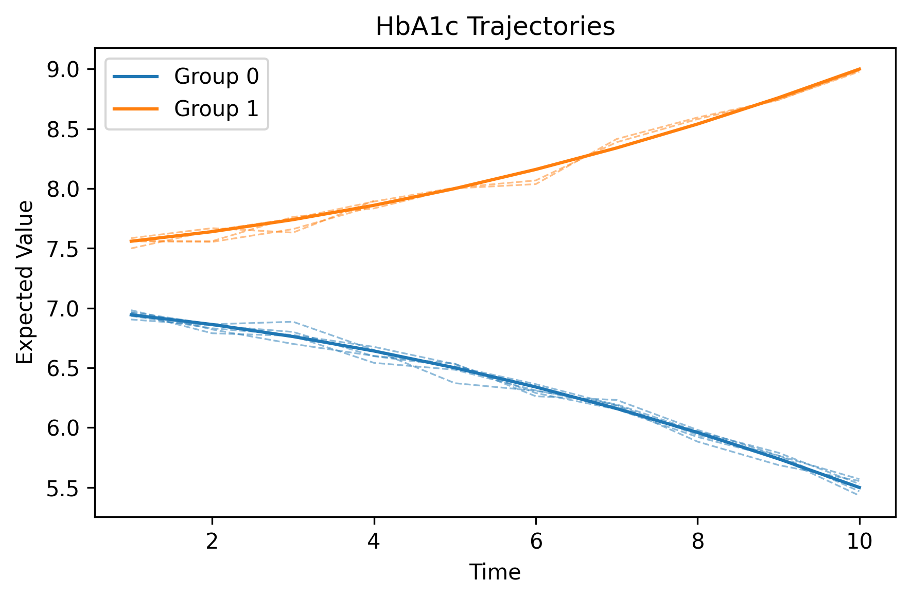
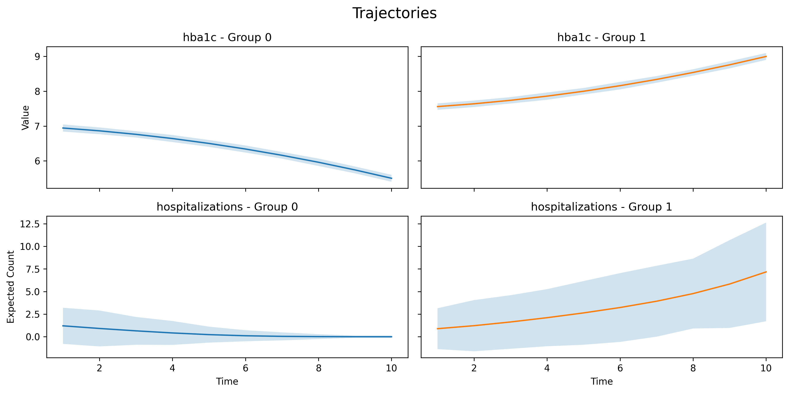
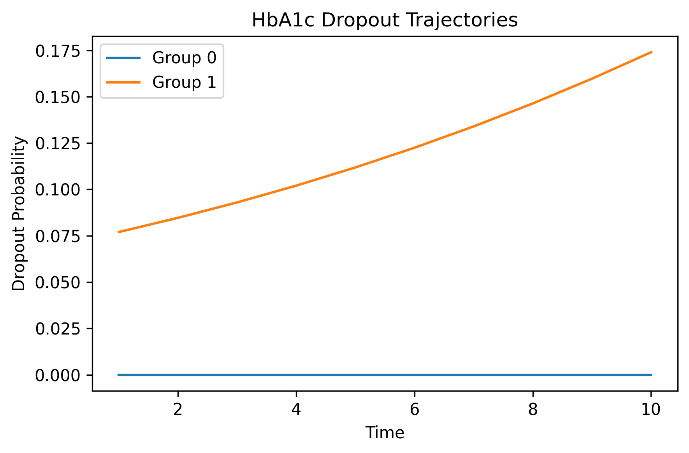

# 📈 gbtm: Group-Based Trajectory Modeling in Python

## 1. Introduction

Group-Based Trajectory Modeling (GBTM) is a statistical technique used to identify clusters of individuals who follow similar developmental trajectories over time. It assumes that a population is composed of a finite number of latent subgroups (or classes), with each subgroup following its own parametric time trend. While popular packages implement this in Stata (traj) and R (flexmix, lcmm), a dedicated, user-friendly implementation has been less common in Python. This package was created to provide Python users with a tool to fill that gap and to implement recent advances in the field.

GBTM identifies distinct subgroups, each characterized by a unique developmental trajectory. For each latent class $j$, the expected outcome for an individual $i$ at time $t$, denoted as $y_{it}^{(j)}$, is modeled as a polynomial function of time.

The general form for the mean (or a transformed mean) for a model of degree d is:

$$y_{it}^{(j)} = \beta_0^{(j)} + \beta_1^{(j)}t + ... + \beta_d^{(j)}t^d$$

Specific link functions are applied depending on the distribution of the outcome variable.

### Supported Distributions

`gbtm` supports the following outcome distributions:

- **Censored Normal**: For continuous outcomes with floor or ceiling effects. The mean for group $j$ at time $t$, $\mu_t^{(j)}$, is modeled directly:

$$\mu_t^{(j)} = \beta_0^{(j)} + \beta_1^{(j)}t + ... + \beta_d^{(j)}t^d$$


- **Bernoulli:** For binary outcomes. The logit link function is used to model the probability of the outcome for group $j$ at time $t$, $p_t^{(j)}$:  

$$logit(p_t^{(j)}) = \beta_0^{(j)} + \beta_1^{(j)}t + ... + \beta_d^{(j)}t^d$$

- **Zero-inflated Poisson:** For count outcomes that have an excess number of zeros. This model includes two components:
    - The count rate, $\lambda_t^{(j)}$, is modeled using a log link function:  

    $$log(\lambda_t^{(j)}) = \beta_0^{(j)} + \beta_1^{(j)}t + ... + \beta_d^{(j)}t^d$$
    - The probability of an excess zero, $p_t^{(j)}$, is modeled using a logit link function:   

    $$logit(p_t^{(j)}) = \gamma_0^{(j)} + \gamma_1^{(j)}t + ... + \gamma_d^{(j)}t^d$$

### Handling Missing Data

Missing outcome data is addressed in two ways:
* **Missing At Random (MAR):** The core Expectation-Maximization (EM) algorithm is designed to use all available data, making it robust to values that are missing at random.
* **Non-Random Attrition (MNAR):** The optional dropout model as described by Haviland<sup>4</sup> helps to account for non-random attrition, where the probability of a value being missing is related to the individual's trajectory.


---

## 2. Class Parameters

### `GBTM` class

| Parameter       | Type              | Description |
|-----------------|-------------------|-------------|
| `data`          | pd.DataFrame      | Longitudinal data in long-format |
| `K`             | int               | Number of latent classes                                            |
| `degree`        | int               | Degree of the polynomial for trajectories (e.g., 2 = quadratic)     |
| `time_col`      | str               | Time/age column name |
| `unit_col`      | str               | ID/unit column name |
| `outcome_models`| dict              | key-value pair of outcome column (str) and DistributionModel class (class/object)|
| `dropout_models`| dict              | key-value pair of outcome column (str) and DropoutModel class (class/object) (default = None) |
| `static_cov`    | list              | List of static covariates (default = None) |
| `tv_cov`        | list              | List of time-varying covariates (default = None) |
| `max_iter`      | int               | Maximum number of EM iterations (default = 100)  |
| `tol`           | float             | Convergence threshold for change in log-likelihood (default = 1e-8) |
| `verbose`       | bool              | If True, prints progress during fitting (default = True)            |
| `seed`          | int               | Random seed for reproducibility (default = 42)                       |

---

## 3. Class Attributes

After `.fit()` is called, the following attributes are available:

| Attribute        | Description |
|------------------|-------------|
| `outcome_params` | Estimated coefficients for outcome trajectories for each latent class     |
| `dropout_params` | Estimated coefficients for dropout trajectories for each latent class     |
| `pi`             | Estimated class prior probabilities (length K)       |
| `post_wide`      | Posterior probabilities of class membership for each individual (N × K) |
| `assigned_groups`| Most likely class for each unit based on maximum posterior probability |
| `appa`           | Average posterior probability assignment |
| `eic`            | Entropy information criteria   |
| `occ`            | Odds of correct classification |
| `bic`            | Bayesian information criterion |
| `aic`            | Akaike information criterion   |

---


## 4. Example usage: 
Data should be in long-format, where each row is a unique unit and time/age.
- `hba1c` and `hospitalizations` are the outcomes. Missing values are allowed for outcomes.
- `male` is a static covariate
- `age` is a time-varying covariate

| id     | time   | hba1c    | hospitalizations | male        | age     |
|--------|--------|----------|------------------|-------------|---------|
| 1      | 1      | 7.3      | 3                | 0           | 59      |
| 1      | 2      | 7.9      | 4                | 0           | 60      |
| 2      | 1      | 6.7      | 0                | 1           | 34      |
| 2      | 2      | np.nan   | 0                | 1           | 35      |
| 3      | 2      | 6.5      | 1                | 1           | 43      |

### Case 1 - Univariate trajectories
```python
import numpy as np
from gbtm.distributions import CensoredNormalModel, ZipModel, BernoulliModel, DropoutModel
from gbtm import GBTM

# Fit 2-class univariate model with linear trajectories
model = GBTM(
    data=data,
    K=2,
    degree=2,
    time_col="time",
    unit_col="id",
    outcome_models = {
        "hba1c": CensoredNormalModel(sigma=0.05,lower_bound=0, upper_bound=50) # ZIPModel and BernoulliModel for count and binary data
    },
    static_cov=None, # we can choose to model without covariates
    tv_cov=None
)
model.fit()

# obtain assigned groups and metrics
assigned_groups = model.assigned_groups
bic, aic, appa, occ, eic = model.bic, model.aic, model.appa, model.occ, model.eic

# plot univariate trajectories
fig, ax = plt.subplots(figsize=(10, 6))

model.plot_univariate_trajectories(
    outcome="hba1c",
    dropout=False,
    title="Hba1c trajectories",
    y_label="Expected Value",
    x_label="Time",
    plot_confidence=False,
    plot_spaghetti=True,
    num_samples=5, # number of spaghetti plots per group
    ax=ax
)

plt.show()
```



### Case 2 - Multivariate trajectories
```python
import numpy as np
from gbtm.distributions import CensoredNormalModel, ZipModel, BernoulliModel, DropoutModel
from gbtm import GBTM

# Fit 2-class multivariate model (Censored Normal dist for HbA1c, ZIP dist for hospitalizations)
model = GBTM(
    data=data,
    K=2,
    degree=2,
    time_col="time",
    unit_col="id",
    outcome_models = {
        "hba1c": CensoredNormalModel(sigma=0.05,lower_bound=0, upper_bound=50),
        "hospitalizations": ZIPModel()
    },
    static_cov=["male"],
    tv_cov=["age"]
)
model.fit()

# obtain assigned groups and metrics
assigned_groups = model.assigned_groups
bic, aic, appa, occ, eic = model.bic, model.aic, model.appa, model.occ, model.eic


# Initialize the figure and a 2x2 grid of subplots with a specific figure size
fig, axs = plt.subplots(n_rows=2, # number of outcomes
                        n_cols=2, # K
                        figsize=(12, 8), sharex="col", sharey="row")

# plot multivariate trajectories
model.plot_multivariate_trajectories(
    outcome_list=["hba1c", "hospitalizations"],
    dropout=False,
    title="Trajectories",
    y_label="Expected Value",
    x_label="Time",
    plot_confidence=True,
    plot_spaghetti=False,
    num_samples=5, # number of spaghetti plots per group, only useful if plot_spaghetti=True
    fig=fig,
    axs=axs
)

plt.show()
```



### Case 3 - Univariate trajectory with dropout (Extensible to multivariate)
```python
import numpy as np
from gbtm.distributions import CensoredNormalModel, ZipModel, BernoulliModel, DropoutModel
from gbtm import GBTM

# Fit 2-class univariate model with dropout
model = GBTM(
    data=data,
    K=2,
    degree=2,
    time_col="time",
    unit_col="id",
    outcome_models = {
        "hba1c": CensoredNormalModel(sigma=0.05,lower_bound=0, upper_bound=50),
        "hospitalizations": ZIPModel()
    },
    dropout_models={
        "hba1c": DropoutModel(degree=1)
    },
    static_cov=["male"],
    tv_cov=["age"]
)
model.fit()

# obtain assigned groups and metrics
assigned_groups = model.assigned_groups
bic, aic, appa, occ, eic = model.bic, model.aic, model.appa, model.occ, model.eic

# plot multivariate trajectories
fig, ax = plt.subplots(figsize=(10, 6))

model.plot_univariate_trajectories(
    outcome="hba1c",
    dropout=True, # Visualize dropout
    title="HbA1c Dropout Trajectories",
    y_label="Dropout Probability",
    x_label="Time",
    plot_confidence=False,
    plot_spaghetti=False,
    num_samples=5, # number of spaghetti plots per group
    ax=ax
)

plt.show()
```



## 5. References
1) Nagin et al. (1999). Analyzing developmental trajectories: A semiparametric, group-based approach.  
2) Nagin et al. (2005). Group-Based Modeling of Development.  
3) Hall et al. (2000). Zero-inflated Poisson and binomial regression with random effects: a case study.  
4) Haviland et al. (2011). Group-based Trajectory Modeling Extended to Account for Nonrandom Participant Attrition.  
5) Nagin et al. (2016). Group-based multi-trajectory modeling.  
6) Awa Diop et al. (2024). Assessing the performance of group-based trajectory modeling method to discover different patterns of medication adherence.

## 6. Future implementations:
- Beta distribution
- Accept missing values for covariates